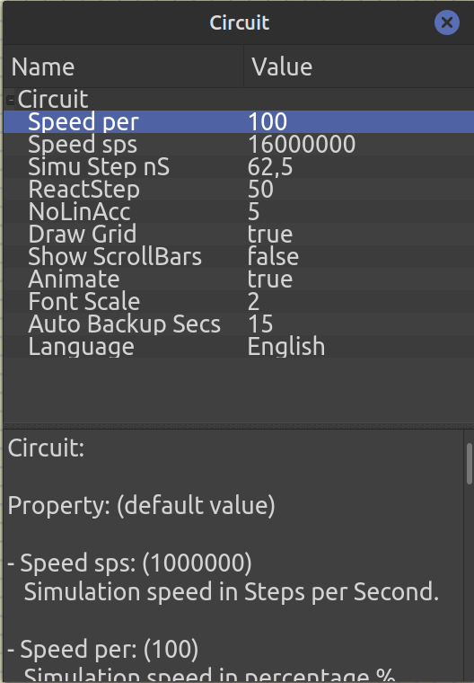

# T2 de PBN

[https://github.com/arthurmluz/megasenha-avr](https://github.com/arthurmluz/megasenha-avr)

**Integrantes:** Lucas Antunes e Arthur Luz

Para rodar o trabalho, execute `make`, abra `circuit.simu` no simulide e carregue o arquivo `code.hex` no microcontrolador.

**Importante:** É possível que a simulação não execute corretamente e fique com velocidade de 0%. Se isso acontecer,
clique com o botão direito em qualquer lugar e acesse "properties". Os três primeiros parâmetros da janela que abrir
devem estar iguais à imagem abaixo.

